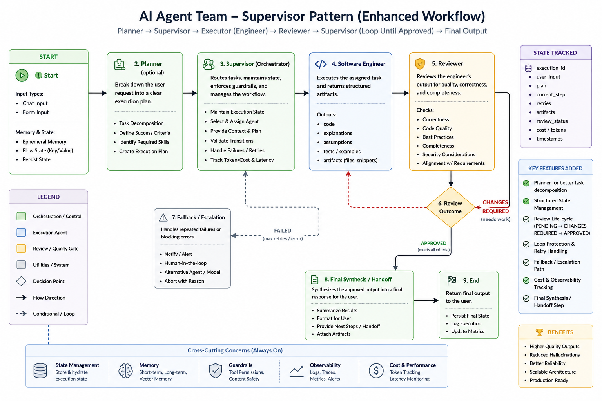

# AI Agent Team — Supervisor Pattern
### Flowise AgentFlows V2/V3 — Enterprise Multi-Agent Orchestration

Enterprise-grade multi-agent orchestration workflow for autonomous
software delivery, review governance, and AI engineering collaboration.

---

## Overview

This project demonstrates a production-inspired supervisor-agent
architecture where multiple AI agents collaborate as a structured
engineering organization — replacing a single monolithic AI response
with specialized agents that plan, execute, review, and deliver.

The system simulates:
- Software Engineering
- Code Review & QA Governance
- Architecture Validation
- Delivery Synthesis

---

## Enhanced Workflow Diagram



> Full enhanced architecture including Planner, Fallback/Escalation,
> State Management, Observability, and Cost Tracking layers.

---

## Core Architecture

```
User Request (chat or form input)
        ↓
┌─────────────────────────────────────────┐
│         2. PLANNER (optional)           │
│  Decomposes request into execution plan │
│  Defines success criteria               │
│  Identifies required skills             │
└──────────────┬──────────────────────────┘
               ↓
┌─────────────────────────────────────────┐
│         3. SUPERVISOR (Orchestrator)    │
│  Routes tasks — maintains state         │
│  Enforces guardrails                    │
│  Handles failures and retries           │
│  Tracks token/cost and latency          │
└──────────────┬──────────────────────────┘
               ↓
    ┌──────────────────────┐
    │   CONDITION ROUTER   │
    │  Reads $flow.state   │
    └──┬───────────┬───────┘
       │           │
       ▼           ▼
  SOFTWARE     REVIEWER
  ENGINEER     (QA Eng)
  Full Stack   Quality
  Developer    Assurance
       │           │
    Loop↑       Loop↑
   (max 5)    (max 5)
       └───────────┘
               ↓
        6. REVIEW OUTCOME
        ┌──────────────┐
        │  APPROVED    │ → continues
        │  CHANGES     │ → loops back
        │  REQUIRED    │   to engineer
        └──────────────┘
               ↓
┌─────────────────────────────────────────┐
│      7. FALLBACK / ESCALATION           │
│  Triggered on max retries or errors     │
│  Options: notify / human-in-the-loop /  │
│  alternative agent / abort with reason  │
└──────────────┬──────────────────────────┘
               ↓
┌─────────────────────────────────────────┐
│      8. FINAL SYNTHESIS / HANDOFF       │
│  Summarizes approved output             │
│  Formats for user                       │
│  Provides next steps                    │
│  Attaches artifacts                     │
└──────────────┬──────────────────────────┘
               ↓
┌─────────────────────────────────────────┐
│            9. END                       │
│  Persists final state                   │
│  Logs execution                         │
│  Updates metrics                        │
└─────────────────────────────────────────┘
```

**Cross-Cutting Concerns (Always On)**

| Layer | Function |
|---|---|
| State Management | Store and hydrate execution state |
| Memory | Short-term, long-term, and vector memory |
| Guardrails | Tool permissions, content safety |
| Observability | Logs, traces, metrics, alerts |
| Cost & Performance | Token tracking, latency monitoring |

---

## Agent Roles

| Agent | Role | Responsibility |
|---|---|---|
| Planner | Task Decomposer | Breaks request into execution plan with success criteria |
| Supervisor | Orchestrator | Routes tasks, manages state, enforces guardrails |
| Software Engineer | Developer | Full stack implementation with code, tests, and artifacts |
| Reviewer / QA | Quality Gate | Validates correctness, security, completeness |
| Final Synthesizer | Delivery | Packages approved output into final response |

---

## Key Features

- Supervisor-pattern dynamic routing — not fixed linear chaining
- Optional Planner for better task decomposition on complex requests
- Structured output routing via enum state (SOFTWARE / REVIEWER / FINISH)
- Review lifecycle: PENDING → CHANGES REQUIRED → APPROVED
- Shared flow state management ($flow.state.next / instructions)
- Loop control — each agent iterates up to 5 times per cycle
- Fallback / Escalation path with human-in-the-loop option
- Execution state tracking with quality score and iteration count
- Full conversation memory shared across all agents
- Cost and observability tracking built in
- Built on Flowise AgentFlows V2/V3 framework

---

## Execution State Tracking

The workflow maintains runtime state throughout execution:

```json
{
  "execution_id": "",
  "user_input": "",
  "plan": "",
  "current_step": "",
  "retries": 0,
  "artifacts": [],
  "review_status": "PENDING",
  "quality_score": 0,
  "iteration_count": 0,
  "cost_tokens": 0,
  "timestamps": {}
}
```

---

## Governance & Safety Controls

- Loop protection — max retry limits per agent
- Escalation fallbacks on repeated failures
- Structured JSON outputs for deterministic routing
- Reviewer approval gates before delivery
- Content safety guardrails always active
- Human-in-the-loop escalation option

---

## Tech Stack

| Layer | Technology |
|---|---|
| Workflow Engine | Flowise AgentFlows V2/V3 |
| AI Models | GPT-4o, GPT-4o-mini |
| Orchestration | LangChain Sequential Agents |
| Routing | Condition Nodes + Loop Nodes |
| Memory | Ephemeral + Flow State (Key/Value) |
| Infrastructure | Docker, AWS, Vercel, Supabase, Redis |

---

## Agent Configuration

| Setting | Value |
|---|---|
| Model | gpt-4o-mini |
| Temperature | 0.9 |
| Memory | All messages (shared across agents) |
| Max Loops | 5 per agent |
| Routing | Enum structured output |
| Framework | Flowise AgentFlows V2/V3 |

---

## Setup & Import

1. Install and run Flowise:
```bash
npm install -g flowise
npx flowise start
```

2. Open Flowise at `http://localhost:3000`

3. Import the agent:
   - Click **Agentflows** → **Add New**
   - Click **Import**
   - Upload `AI Agent Teams Agents.json`

4. Add your OpenAI API key in Flowise credentials

5. Click **Save** and **Deploy**

6. Enter a software development request to start

---

## Example Output — Renaissance Research AI

**Input:**
```
Build an AI research platform for graduate students
studying 15th century Italian Renaissance paintings
```

The system autonomously produced a complete engineering
delivery package including:

### Technology Stack
- Frontend: Next.js, TypeScript, TailwindCSS
- Backend: FastAPI, PostgreSQL, Redis
- AI Stack: GPT-4o, LangGraph, Pinecone, OCR Pipeline

### Core Features
- AI Research Assistant
- Semantic Painting Search
- Manuscript & Archive Analysis
- Visual Similarity Search
- Citation Generator
- Collaborative Annotation Workspace

### Database Schema (excerpt)
```sql
CREATE TABLE paintings (
    id UUID PRIMARY KEY,
    title TEXT,
    artist TEXT,
    year_created INT,
    medium TEXT,
    image_url TEXT,
    embedding VECTOR(1536)
);

CREATE TABLE research_documents (
    id UUID PRIMARY KEY,
    title TEXT,
    author TEXT,
    publication_year INT,
    summary TEXT,
    embedding VECTOR(1536),
    uploaded_by UUID
);
```

### Deployment Architecture
| Service | Platform |
|---|---|
| Frontend | Vercel |
| Backend | AWS ECS |
| Database | Supabase / PostgreSQL |
| Vector DB | Pinecone |
| Monitoring | LangSmith + OpenTelemetry |

### Reviewer Findings
- ✅ Strong academic specialization
- ✅ Scalable semantic architecture
- ⚠️ OCR costs flagged — recommend async processing
- ⚠️ Hallucination risk noted — source grounding required
- ⚠️ Image storage scaling — CDN optimization recommended

📄 [Full Engineering Delivery Package](doc/Renaissance_Research_AI_Engineering_Package.docx)

---

## Supervisor Pattern vs Sequential Pipeline

| Approach | This Repo | Sequential Pipeline |
|---|---|---|
| Routing | Dynamic (Supervisor decides) | Fixed linear sequence |
| Iteration | Loop-based up to 5x | Single pass |
| Flexibility | High — any agent called multiple times | Low — fixed order |
| Error handling | Fallback / escalation path | None |
| Governance | Reviewer approval gate | None |
| Framework | AgentFlows V2/V3 | Sequential Agents |
| Best for | Complex iterative tasks | Linear content pipelines |

---

## Why This Architecture Matters

Most AI agent demos are linear, stateless, non-deterministic,
and lacking governance. This project introduces:

- Structured orchestration with a dedicated Supervisor
- Review loops with explicit approval lifecycle
- Execution state tracking with quality scoring
- Production governance and fallback handling
- Engineering-style multi-agent collaboration

The result is a more scalable, reliable, and
enterprise-oriented AI workflow.

---

## Future Roadmap

- Planner/Executor split for complex multi-phase tasks
- Multi-reviewer architecture for parallel QA
- Tool execution sandboxing
- Persistent memory across sessions
- LangSmith tracing integration
- Cost-aware model routing
- Human approval checkpoints
- Autonomous testing agents

---

## Files Included

| File | Description |
|---|---|
| [AI Agent Teams Agents.json](AI%20Agent%20Teams%20Agents.json) | Flowise agent configuration |
| [doc/workflow.png](doc/workflow.png) | Enhanced workflow architecture diagram |
| [doc/Renaissance_Research_AI_Engineering_Package.docx](doc/Renaissance_Research_AI_Engineering_Package.docx) | Example engineering delivery package |
| [changelog.md](changelog.md) | Release history |

---

## Related Repos

| Repo | Pattern | Framework |
|---|---|---|
| [ai-multi-agent-content-pipeline](https://github.com/Paul-Orlando/ai-multi-agent-content-pipeline) | Sequential Agents | Flowise Sequential |
| [ai-web-scraper-research-agent](https://github.com/Paul-Orlando/ai-web-scraper-research-agent) | RAG Pipeline | Flowise + FAISS |
| [ai-research-assistant-rag](https://github.com/Paul-Orlando/ai-research-assistant-rag) | RAG + Python | Python + OpenAI API |
| [Data-Analysis-Agent](https://github.com/Paul-Orlando/Data-Analysis-Agent) | Custom GPT | ChatGPT + Versioned Instructions |

---

## Author

Paul Orlando
Creative Technologist | AI Agent Developer | Data Analytics
🌐 [paulforlando.com](https://www.paulforlando.com)
💼 [LinkedIn](https://www.linkedin.com/in/paul-orlando-7841b5154)
🐙 [GitHub](https://github.com/Paul-Orlando)

---

## License

MIT License
